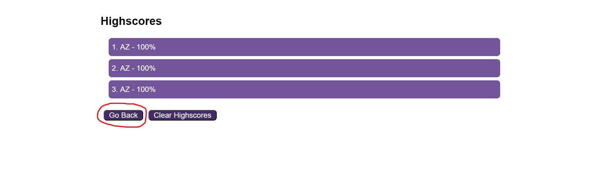

# Timed-Quiz

## Description

This project uses manipulation of the DOM to dymanically display information. Being able to comfortably change the html, access information from the html and attach on click events to elements in html was recently taught in the bootcamp im enrolled in. This project taught me how to traverse the DOM, create new elements in javascript, append those elements, set timed intervals, add on click events, change the data state of an element, dynamically display information on screen and how to manage data stored in local storage.

## Usage

When the webpage is first loaded, there is the instructions of the quiz, timer will decrease if questions are answered incorrectly, and quiz will end if timer runs out or all answers are selected.

The quiz questions will be displayed as followed, after clicking on an answer, there will be a message displayed below stating if the selected answer was correct or wrong, message will display for 1 second.

You will then be shown the screen where you can enter you initals so that your initals and score will be saved in the local storage.

You can access the highscore screen through the header "Your Highscores" link [first image], or after submitting your initals [second image].

This is what the highscores page looks like

On the highscore screen you will find 2 buttons, one to go back to the beginning of the quiz [first image] and the other is to clear your highscores [second image].

This is what the page would look like after pressing the Clear Highscores button

Live Deployed URL: https://timebytes.github.io/Timed-Quiz/

## Credits

This webpage was designed by a mock up from the University of Toronto Bootcamp
https://courses.bootcampspot.com/courses/3937/assignments/50865?module_item_id=920642

## License

MIT License
